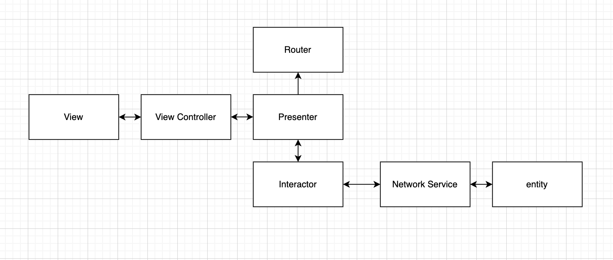

# Movies APP

# Architecture
I choose to use VIPER (View-Interactor-Presnter-Entite-Router) as my project architecture in order to provide a cleaner code, with clear separation between the view, the data and the business logic. The following diagram shows all the modules and how each module interact with one another after. 
This architecture using a layered software architecture.

* Digram 

  
